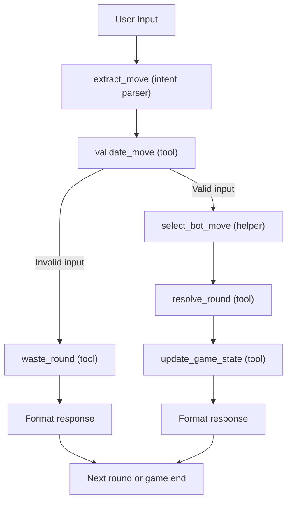

# Rock-Paper-Scissors-Bomb (RPSB)

A deterministic, tool-based game system for a conversational Rock-Paper-Scissors variant with a one-time "bomb" move. Designed with Google ADK.

TLDRs:

- Game state is maintained explicitly as an in-memory object and passed between agent turns and tools. No state is stored in prompts or persisted across sessions.
- No LLM logic in game rules. No state in prompts. Fully auditable.
- If the user input is invalid, the round is consumed without selecting a bot move or resolving a winner.
- The game ends after 3 rounds (draw if scores equal).

## Architecture



## Game State Model

```python
@dataclass
class GameState:
    current_round: int        # 1-3
    user_score: int
    bot_score: int
    user_bomb_used: bool      # One-time use
    bot_bomb_used: bool
    round_history: list       # All moves + outcomes
    game_over: bool
    final_winner: str | None  # "user", "bot", or "draw"
```

State is maintained in memory and passed between tools. It is not stored in model prompts or persisted across sessions.

## Tool Responsibilities

| Tool | Input | Output | Mutates State? |
|------|-------|--------|----------------|
| `validate_move` | move, player, state | `{is_valid, normalized_move, reason}` | No |
| `resolve_round` | user_move, bot_move, state | `{winner, explanation}` | No |
| `update_game_state` | state, moves, winner | `{updated_game_state}` | **Yes** (only source) |

All game rules live in tools. The LLM/agent never implements logic—only intent extraction and response formatting.

## Agent Flow

```
User Input → extract_move (dictionary) → validate_move (tool)
                                              ↓
                                         [invalid?] → round wasted (no score changes)
                                              ↓                       ↓
                                         select_bot_move (helper)     ↓
                                              ↓                       ↓    
                                         resolve_round (tool)         ↓
                                              ↓                       ↓
                                         update_game_state (tool)<- <- 
                                              ↓
                                         Format response → User
```

## Usage

```bash
# Normal mode
python agent.py

# Optional Debug mode (logging)
python agent.py --debug
```

## Tradeoffs

| Decision | Tradeoff |
|----------|----------|
| **Dictionary-based helper for intent parsing** | Fast, no API calls, but limited to predefined synonyms. May Misses creative edge cases and phrasings. |
| **Explicit in-memory state** | Fully deterministic and testable, but requires passing state on every call. |
| **Single mutation point** | Easy to audit state changes, but `update_game_state` is a larger function. |
| **Best-of-3 hardcoded** | Simpler implementation. Would need refactoring for configurable round counts. |
| **Bot uses random selection** | No strategy = fair for casual play, but predictable opponent behavior. |
| **Optional --debug mode** | Separate Verbose logging for debugging and a main mode for cleaner conversational flow. |
## File Summary

| File | Purpose |
|------|---------|
| `game_state.py`| State dataclass + serialization |
| `agent.py`| Orchestrator + game loop + CLI |
| `tools/*.py`| Validation, resolution, state mutation |
| `helpers/*.py`| Intent parsing, bot moves |
| `logger.py`| Optional Structured debug logging |

---
